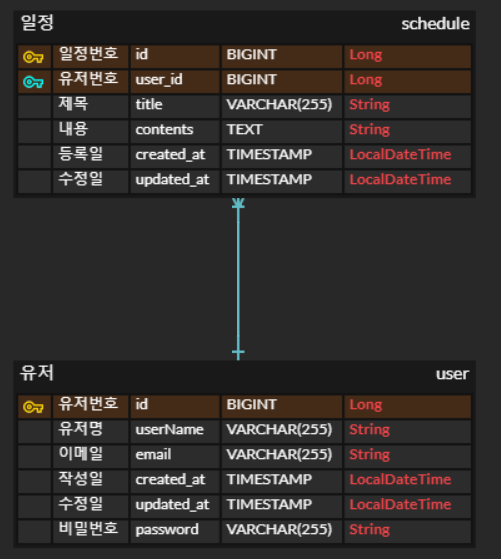

# 📌 Scheduler (JPA) 과제 📌

#### 3 Layer 아키텍처 형식을 지키면서 CRUD과정을 구현하는 일정관리 앱 서버 만들기 (JPA 방식)
#### 기간 : 2025. 3. 27 ~ 2025. 04. 04
#### 개발 인원 : 1명

## ⭐필수 

### Lv0. API 명세서 및 ERD 작성

#### ※ 일정 관리 API 명세서

#### <a href="https://workable-hacksaw-44c.notion.site/1cacef54a3568093af7cff9795966c22?v=1cacef54a35681258ab8000cae49b073">일정 관리 API 명세서(v2)</a>

#### ※ ERD 작성

### Lv1. 일정 CRUD

- [ ]  일정을 생성, 조회, 수정, 삭제할 수 있습니다.
- [ ]  일정은 아래 필드를 가집니다.
    - [ ]  `작성 유저명`, `할일 제목`, `할일 내용`, `작성일`, `수정일` 필드
    - [ ]  `작성일`, `수정일` 필드는 `JPA Auditing`을 활용합니다

### Lv2. 유저 CRUD

- [ ]  유저를 생성, 조회, 수정, 삭제할 수 있습니다.
- [ ]  유저는 아래와 같은 필드를 가집니다.
    - [ ]  `유저명`, `이메일`, `작성일` , `수정일` 필드
    - [ ]  `작성일`, `수정일` 필드는 `JPA Auditing`을 활용합니다.
- [ ]  연관관계 구현
    - [ ]  일정은 이제 `작성 유저명` 필드 대신 `유저 고유 식별자` 필드를 가집니다.

### Lv3. 회원가입

- [ ]  유저에 `비밀번호` 필드를 추가합니다.
    - 비밀번호 암호화는 도전 기능에서 수행합니다. (passwordEncoder)

### Lv4. 로그인

- [ ]  **설명**
   - [ ]  **Cookie/Session**을 활용해 로그인 기능을 구현합니다. → `2주차 Servlet Filter 실습 참고!`
   - [ ]  필터를 활용해 인증 처리를 할 수 있습니다.
   - [ ]  `@Configuration` 을 활용해 필터를 등록할 수 있습니다.
- [ ]  **조건**
   - [ ]  `이메일`과 `비밀번호`를 활용해 로그인 기능을 구현합니다.
   - [ ]  회원가입, 로그인 요청은 인증 처리에서 제외합니다.
- [ ]  **예외처리**
   - [ ]  로그인 시 이메일과 비밀번호가 일치하지 않을 경우 HTTP Status code 401을 반환합니다.

## 📝개선사항
